# Minecraft Sin, Cos Calculator

Trigonometry(Sin, Cos) calculator in Minecraft.  
The project was completed on July 12, 2017.

Video: https://youtu.be/77p_mvShuGQ

## Features
- The algorithm used to calculate the sin, cos value is [CORDIC](https://en.wikipedia.org/wiki/CORDIC)
- My own conversion algorithm was used to convert fractions between Binary and BCD: [Video](https://youtu.be/nwZJh3b39Bg)
- Sequential Logic Circuit (It takes about 6m 30s to calculate one value)
- Input(00.0000 ~ 99.9999), Output(0.0 ~ 1.0)

## Samples
|-|image|
|:--:|:--:|
|Circuit  | 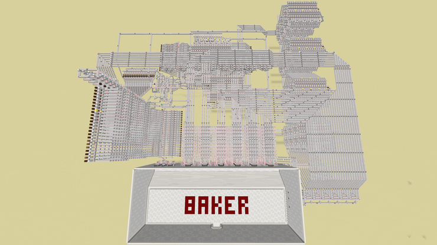 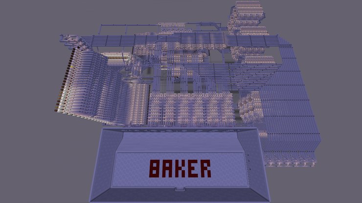|
|Screen  | 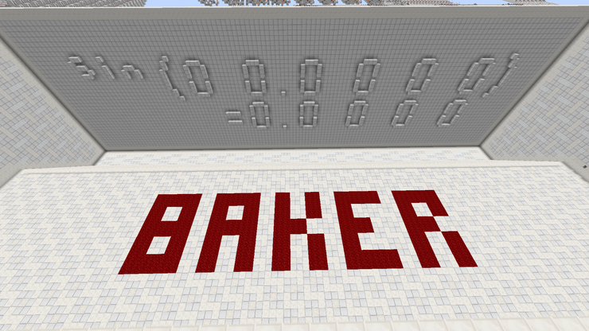|  

|input|Sin|Cos|
|:--:|:--:|:--:|
|12.3456| 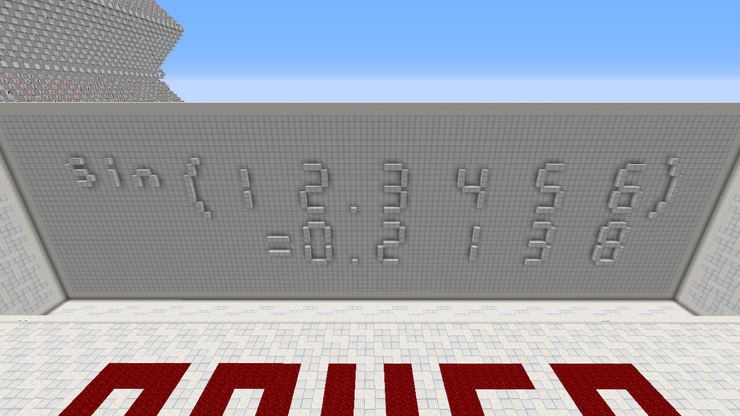|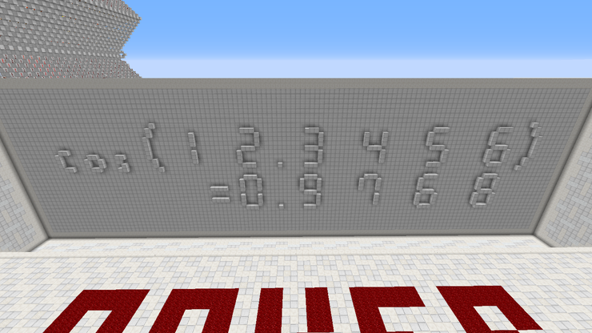|
|77.7777| 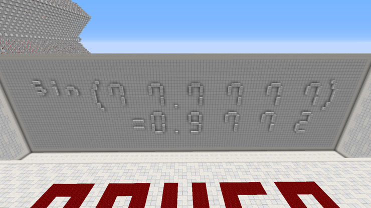|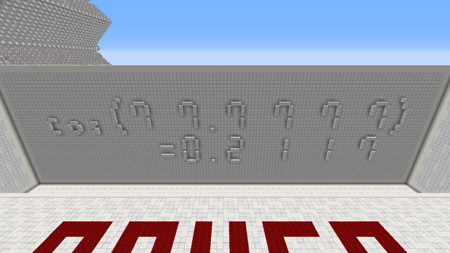|
|74.4319| 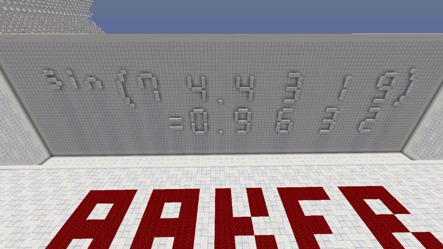|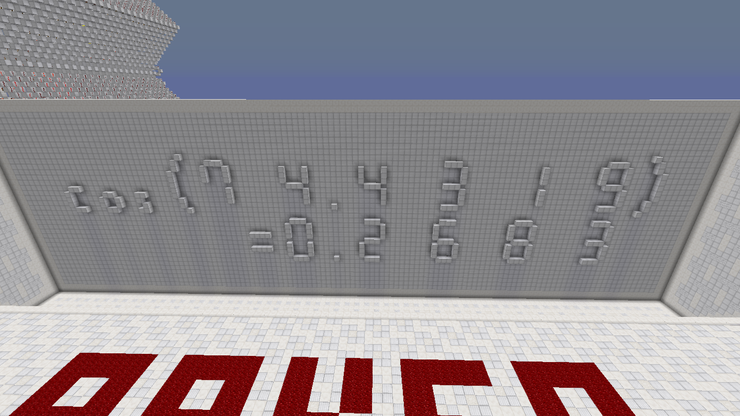|
|5.| 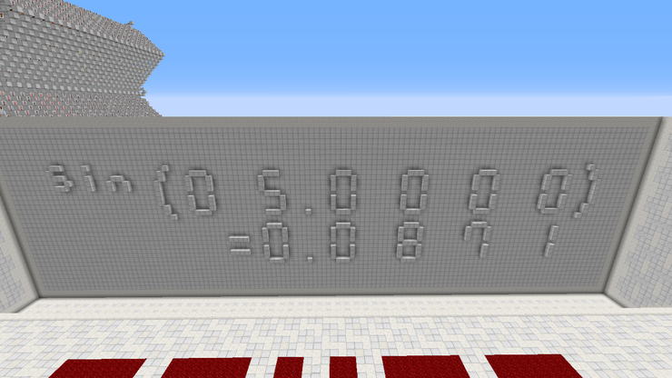|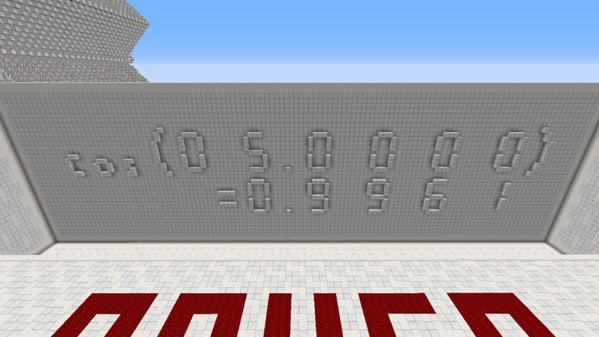|
|85.| 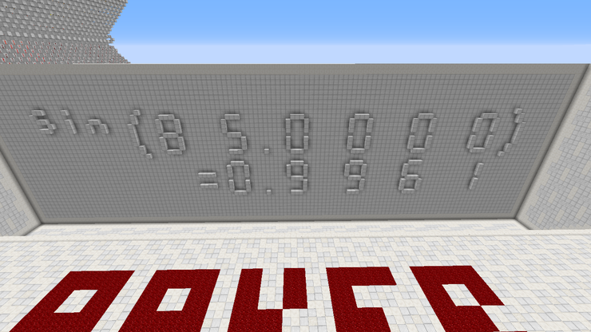|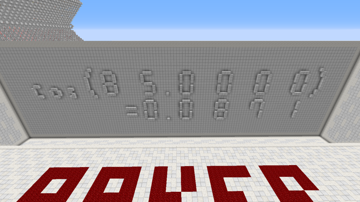|

## Notes

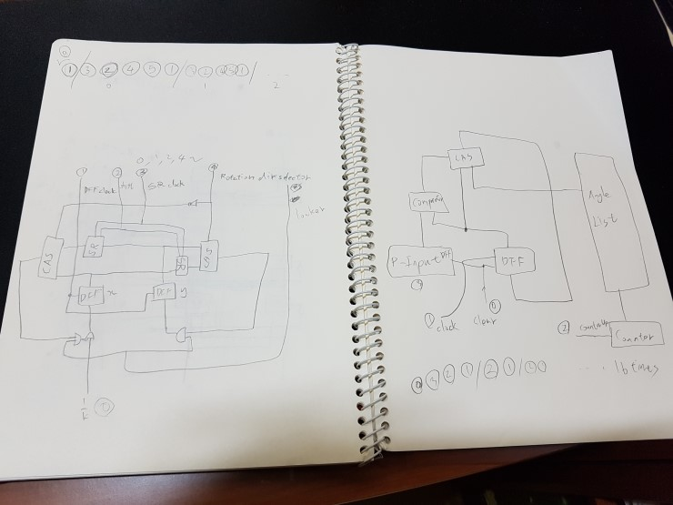

 
  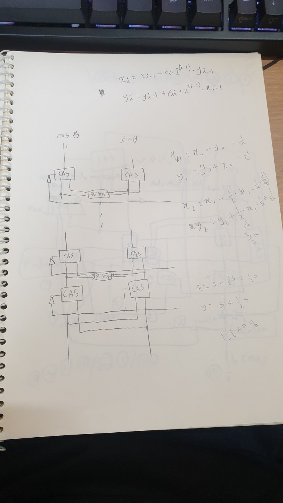 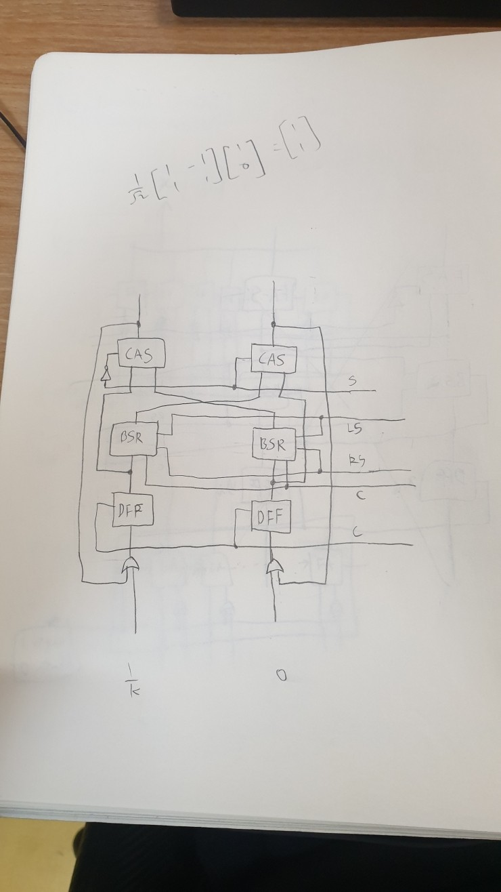

